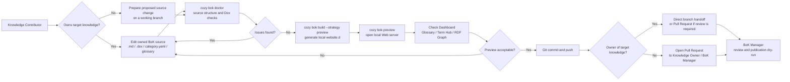
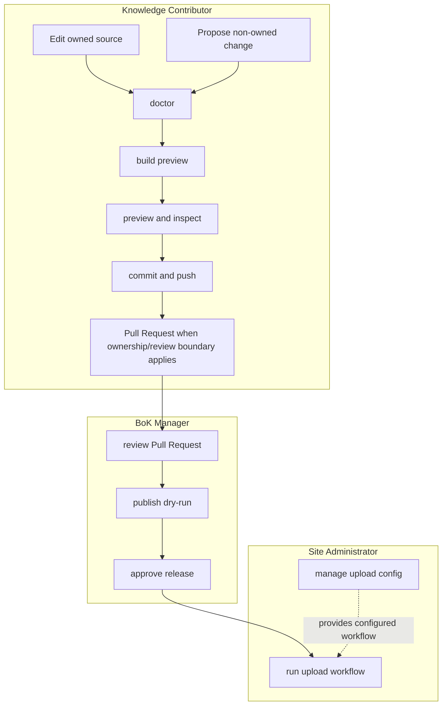
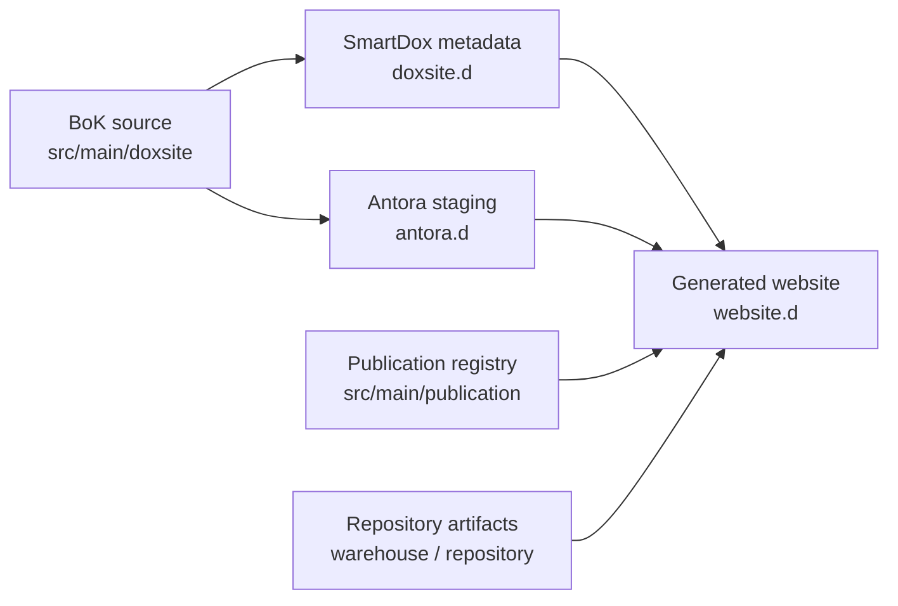

# BoK Knowledge Contributor Operation Diagram Handoff

Date: 2026-06-23
Status: Handoff
Owner: Cozy BoK
Target: BoK Manual / KnowledgeHub operational guide

## Purpose

Create a diagram for Knowledge Contributors who add, update, or propose BoK content.
The diagram should explain how a contributor moves from source editing to local
checks, preview, Git handoff, and review without implying that the contributor
owns publication or upload.

## Audience

Primary actor: Knowledge Contributor

Ownership relation:

- Knowledge Owner: the contributor who owns a specific piece of knowledge.
- A Knowledge Contributor can be the Knowledge Owner for some knowledge.
- For knowledge they own, they edit Git source and push a branch.
- For knowledge they do not own, they propose changes through a Pull Request.

Related actors:

- Reader: consumes generated BoK pages, glossary, and RDF navigation.
- BoK Manager: reviews Pull Requests and runs publication dry-run or release flow.
- Site Administrator: owns upload credentials and hosting workflow.

The diagram must keep the Knowledge Contributor path primary. Ownership changes
whether the path is direct source maintenance or Pull Request proposal. Other
actors should appear only at the handoff and review boundary.

## Message

A Knowledge Contributor works on BoK source, not generated outputs. Ownership
controls the handoff path.

For owned knowledge:

1. Edit article, term, category, or RDF source.
2. Run BoK doctor checks.
3. Build preview locally.
4. Review Dashboard / Glossary / RDF views.
5. Iterate until the preview is acceptable.
6. Commit and push the working branch.

For knowledge owned by someone else:

1. Prepare the proposed source change on a working branch.
2. Run the same doctor and preview checks.
3. Open a Pull Request to the relevant Knowledge Owner or BoK Manager.

Pull Request is the boundary for review, merge, and publication decisions.

## Source And Generated Boundaries

Source files managed by Knowledge Contributors:

- `src/main/doxsite/**/*.dox`
- `src/main/doxsite/**/*.md`
- `src/main/doxsite/**/category.yaml`
- `src/main/doxsite/glossary/**/*.dox`
- `src/main/doxsite/rdf/**` when RDF seed/source files are explicitly project-owned

Generated or operational outputs not edited by Knowledge Contributors:

- `website.d/`
- `doxsite.d/`
- `antora.d/`
- `target/`
- `src/main/publication/` unless the task is explicitly publication registry work
- `warehouse/` or external artifact repositories

## Required Diagram 1: Knowledge Contributor Workflow

Use a left-to-right process diagram. The happy path should be visually dominant;
feedback loops should be shown but not overwhelm the main path.

Design notes:

- `cozy bok preview` must imply an HTTP server, not `file://` browsing.
- Publication and upload are outside the Knowledge Contributor primary path.
- Use “Knowledge Contributor” for the actor.
- Use “Knowledge Owner” only for ownership of a specific knowledge item.
- Pull Request is required for proposed changes to knowledge owned by someone else.

## Required Diagram 2: Responsibility Boundary

Use a swimlane or grouped flow diagram to show that the Knowledge Contributor
does not edit generated output and does not own upload credentials.

## Required Diagram 3: Source-To-Site Artifact Map

Use a compact mapping diagram that clarifies what is source and what is generated.

Design notes:

- Show `src/main/doxsite` as the Knowledge Contributor source root.
- Show `website.d`, `doxsite.d`, and `antora.d` as generated.
- `src/main/publication` should be shown as metadata registry, not article source.

## BoK Manual Placement

Recommended standard Manual topic:

- Knowledge Contributor Workflow

Recommended sections:

1. What a Knowledge Contributor edits
2. Choosing GitHub Markdown or SmartDox
3. Knowledge ownership and proposal boundaries
4. Standard contribution workflow
5. Local checks and preview
6. What not to edit
7. Pull Request handoff to Knowledge Owner / BoK Manager

## Source Format Guidance

- General contributors should use GitHub Markdown for ordinary single-language
  articles.
- Advanced contributors should use SmartDox when they need BoK metadata,
  glossary linkage, RDF linkage, or SmartDox-specific structured authoring.
- Multilingual BoK authoring is SmartDox-only.
- Diagrams should not imply that every contributor must learn SmartDox before
  they can propose useful knowledge changes.

## Dashboard Linkage

The diagram should support the current dashboard design:

- Reader-oriented dashboard remains the primary landing experience.
- Knowledge Contributor uses dashboard as a preview validation surface.
- Knowledge Contributor should check category cards, glossary/term hub, RDF graph links, and recent changes.
- Knowledge Contributor should not treat generated dashboard HTML as source.

## Tone And Visual Style

- Prefer operational clarity over decorative detail.
- Use short labels in nodes.
- Use actor names consistently:
  - Reader
  - Knowledge Contributor
  - Knowledge Owner
  - BoK Manager
  - Site Administrator
- Do not use Knowledge Owner as the primary actor label.
- Avoid mixing Japanese and English inside one diagram unless the target page is bilingual.
- For Japanese BoK Manual, translate labels consistently:
  - Knowledge Contributor: 知識提供者
  - Knowledge Owner: 知識オーナー
  - BoK Manager: BoK管理者
  - Site Administrator: サイト管理者
  - Reader: 利用者

## Acceptance Criteria

- The diagram makes it clear that Knowledge Contributors edit source, not generated outputs.
- The diagram distinguishes owned knowledge maintenance from non-owned knowledge proposals.
- The preview path uses `cozy bok build --strategy preview` and `cozy bok preview`.
- Pull Request is shown as the boundary for non-owned knowledge proposals and publication review.
- Publication/upload responsibilities are shown as later handoff steps.
- The diagram can be embedded into BoK Manual without additional architecture explanation.
- The diagram does not imply that Docker, VOICEVOX, ffmpeg, or video toolchain execution is required for ordinary knowledge contribution.

## Follow-Up Implementation Candidate

After the diagram is finalized, add the diagram to the generated standard BoK
Manual and keep project-local rules in the editable Local Rules page.
